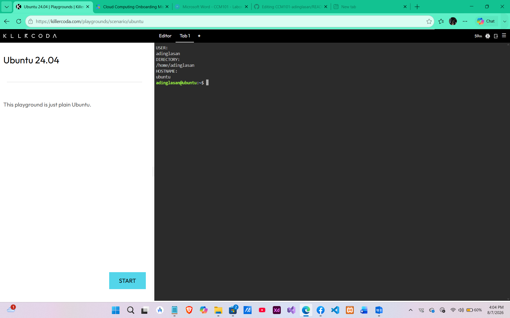
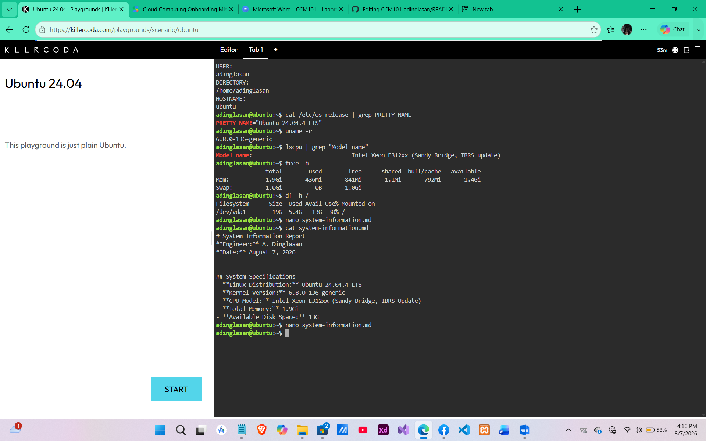
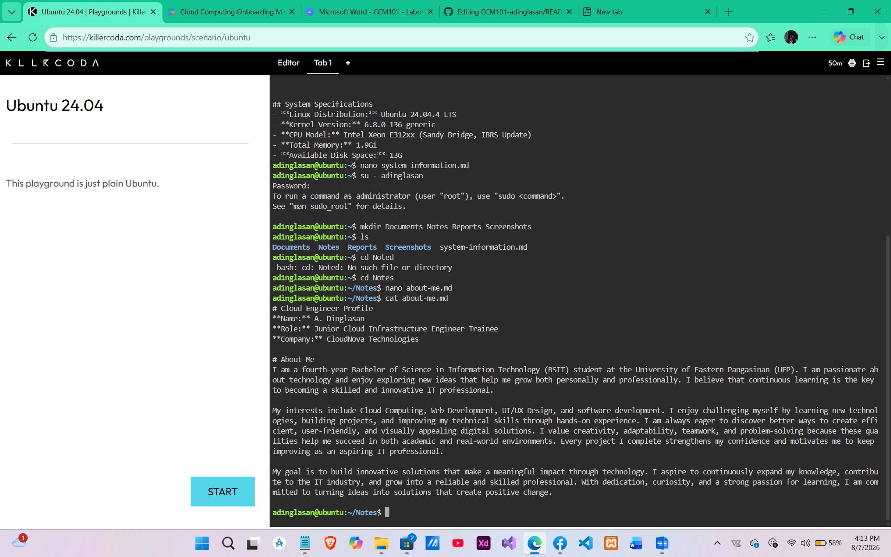

# ☁️ Laboratory Activity 1: Welcome to the Cloud
### 🛡️ CloudNova Technologies | Onboarding Mission 01

   

---

### 🔵 Mission • Learn • Build • Document • Deploy 🔴

*Click the sections below to reveal the mission intelligence.*

---

# 📖 🔵 Mission Overview

<b>▶ CLICK TO REVEAL MISSION BRIEFING</b>

> **Company:** CloudNova Technologies  
> **Role:** Junior Cloud Infrastructure Engineer Trainee  
> **Status:** Active Deployment

Congratulations! As part of this laboratory activity, I assumed the role of a **Junior Cloud Infrastructure Engineer Trainee** at **CloudNova Technologies**, a fictional company specializing in cloud infrastructure, virtualization, and enterprise cloud solutions.

This mission introduced the fundamentals of cloud computing by providing hands-on experience with the Linux operating system, cloud-based environments, and GitHub version control. Using the **KillerCoda Ubuntu Playground**, I completed onboarding tasks that simulated the daily responsibilities of a cloud engineer.

---

# 🎯 🔴 Mission Objectives

<b>▶ CLICK TO REVEAL CORE OBJECTIVES</b>

Upon successfully completing this mission, I was able to:
- [x] **Access** a cloud-based Linux environment using KillerCoda.
- [x] **Explore** and navigate the Linux operating system.
- [x] **Audit** essential system information.
- [x] **Architect** folder and directory structures using CLI.
- [x] **Engineer** technical documentation using Markdown.
- [x] **Deploy** and maintain a professional GitHub repository.

---

# 📝 🔵 Activities Performed

<b>▶ CLICK TO REVEAL TASK CHECKLIST</b>

- ✅ **Environment Launch:** Initialized Ubuntu 24.04 Linux Playground.
- ✅ **User Management:** Created a Linux user with Bash and Sudo privileges.
- ✅ **System Profiling:** Collected Kernel version, CPU specs, and Memory usage.
- ✅ **Infrastructure Setup:** Organized directories: `Documents`, `Notes`, `Reports`.
- ✅ **Documentation:** Authored `about-me.md` and `system-information.md`.
- ✅ **Version Control:** Built the **CCM101-adinglasan** remote repository.

---

# 💻 🔴 Linux Commands Used

<b>▶ CLICK TO REVEAL COMMAND REFERENCE</b>

| Command | Category | Cloud Engineer Purpose |
| :--- | :--- | :--- |
| `whoami` | **Identity** | Verify active user credentials |
| `pwd` | **Navigation** | Confirm current workspace path |
| `mkdir` | **Ops** | Build logical directory architecture |
| `nano` | **Editor** | Terminal-based configuration and scripting |
| `uname -a` | **Kernel** | Audit system kernel version and build |
| `lscpu` | **Hardware** | Investigate CPU architecture |
| `free -h` | **Resources** | Monitor real-time memory (RAM) health |
| `df -h` | **Storage** | Calculate available disk space |
| `git push` | **Deployment** | Sync local code with Cloud Portfolio |

---

# 🚀 🔵 Skills Learned

<b>▶ CLICK TO REVEAL SKILL MATRIX</b>

This laboratory strengthened my foundational knowledge in:
- 🏗️ **Linux Systems Administration**
- 🐚 **Bash Shell Fluency**
- 📁 **Cloud Infrastructure Organization**
- 📝 **Markdown Engineering**
- 🐙 **Git & GitHub Version Control**
- 🧩 **Asynchronous Problem Solving**

These skills provide a strong foundation for future laboratory activities involving **Docker, Kubernetes, and Automation.**

---

# 📸 🔴 Evidence of Work

<b>▶ CLICK TO VIEW SCREENSHOTS</b>

### System Audit & Onboarding
| Checkpoint 1 | Checkpoint 2 | Checkpoint 3 |
| :---: | :---: | :---: |
|  |  |  |

---

## 🔵 Cloud Computing • Linux • GitHub 🔴

> *"Every cloud engineer starts with a single command. This laboratory marks the beginning of my journey in cloud computing and Linux administration."*

⭐ **CCM101 – Cloud Computing Portfolio**
**© 2026 A. Dinglasan | Enterprise Cloud Solutions**

